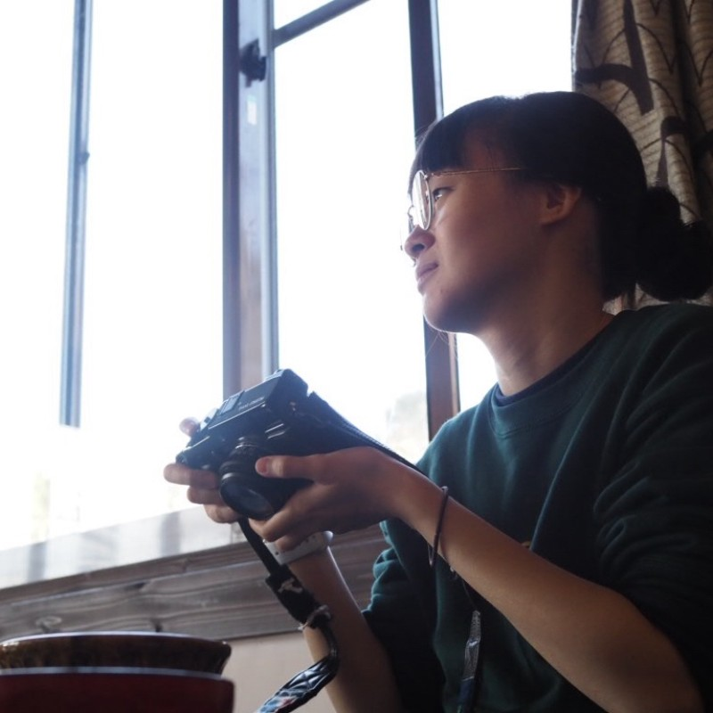

<!--I am a computer vision engineer with 5 years of experience in vision-based deep learning for real-world robotic manipulation and autonomous machine operation.-->

<!--From 2018-2020, I was a graduate student in the Department of Computer Science at the University of Toronto, where I completed my MSc in March 2020. My research was focused on machine learning with applications in computational genomics. -->
<!--I performed research on semi-supervised genome annotation methods in the <a href="https://hoffmanlab.org/">Hoffman lab</a> under the supervision of Prof. Michael Hoffman. -->
<!--From 2020-2022, I worked in Tokyo, Japan as a robotics & computer vision engineer at DeepX, Inc, developing vision-based deep learning technologies for scene comprehension in unstructured environments.-->

<!--Since 2022, I have been working at Sony Research as a Computer Vision Engineer on vision-based deep learning for deformable object manipulation.

My general interests include (but are not limited to):

<ul>
    <li>2D/3D object recognition</li>
    <li>6dof pose estimation</li>
    <li>vision-based deep learning for robotics</li>
    <li>vision-language models</li>
</ul>
-->

I'm a computer vision engineer with 5 years of experience leveraging vision-based deep learning to solve complex, real-world challenges in robotic manipulation and autonomous machine operation. My expertise spans a range of applications, from comprehending unstructured environments to precisely manipulating deformable objects.

<!--I completed a BASc in Engineering Physics, which provided me with a strong interdisciplinary foundation in areas ranging from pure maths to electrical engineering. I then completed an MSc in Computer Science at the University of Toronto (2018-2020), where my research focused on machine learning with applications to computational genomics.-->

I completed my MSc in Computer Science from the University of Toronto (2018-2020), where I researched machine learning with applications in computational genomics. From 2020 to 2022, I worked at DeepX, Inc., developing vision-based deep learning for scene comprehension in complex environments. Currently, at Sony Research since 2022, I focus on vision-based deep learning for deformable object manipulation.

My general interests include:

<ul>
    <li><b>2D/3D Object Recognition</b>: Enabling machines to accurately identify and localize objects in their environment.</li>
    <li><b>6-DoF Pose Estimation</b>: Determining an object's precise position and orientation in 3D space.</li>
    <li><b>Vision-Based Deep Learning for Robotics</b>: Developing intelligent vision systems that allow robots to perceive and interact with the real world.</li>
    <li><b>Vision-Language Models</b>: Exploring the powerful synergy between visual perception and natural language understanding.</li>
</ul>
<!--I'm particularly interested in 2D/3D object recognition, 6-DoF pose estimation, and the exciting convergence of vision-language models with robotics.-->

### Contact

[github](https://github.com/rcwchan); 
[google scholar](https://scholar.google.ca/citations?user=sN1NTD4AAAAJ) 

academic:
~~~ yml
rachelchan [at] cs [dot] toronto [dot] edu
~~~

personal:
~~~ yml
rcwzychan [at] gmail [dot] com
~~~
