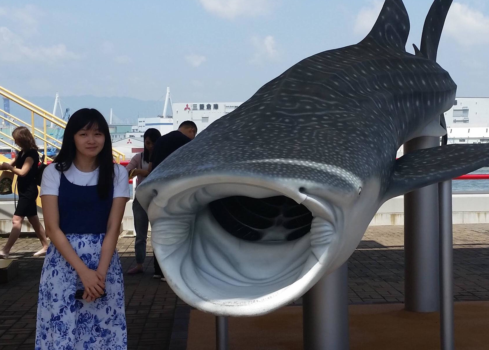

From 2018-2020, I was a graduate student in the Department of Computer Science at the University of Toronto. I completed my MSc in March 2020. 
I performed research on semi-supervised genome annotation methods in the <a href="https://hoffmanlab.org/">Hoffman lab</a> under the supervision of Prof. Michael Hoffman. 

Since 2020, I have been working in Tokyo, Japan as a robotics & computer vision engineer at DeepX, Inc.

My general research interests include (but are not limited to):

<ul>
    <li>3D object recognition and classification</li>
    <li>deep learning</li>
    <li>statistical learning theory</li>
    <li>high-performance computing</li>
    <li>dynamical systems</li>
    <li>clever analytical solutions to partial differential equations</li>
</ul>

### Contact

[github](https://github.com/rcwchan); 
[google scholar](https://scholar.google.ca/citations?user=sN1NTD4AAAAJ) 

academic:
~~~ yml
rachelchan [at] cs [dot] toronto [dot] edu
~~~

personal:
~~~ yml
rcwzychan [at] gmail [dot] com
~~~
